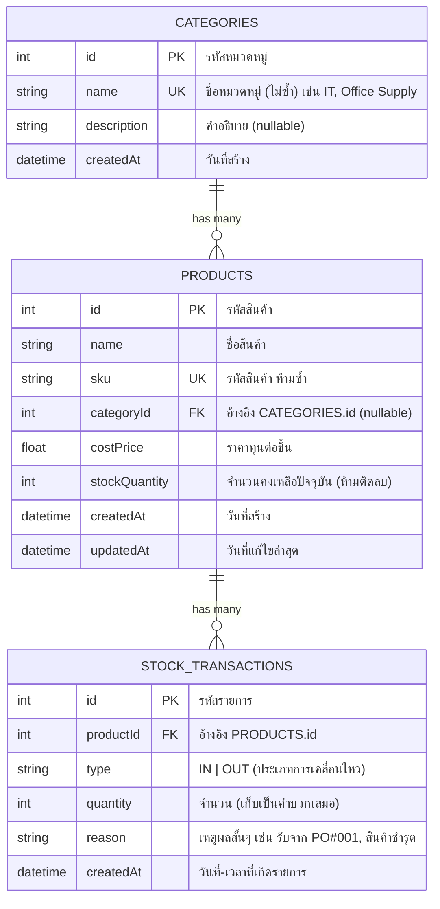

# 🗂️ การออกแบบโครงสร้างข้อมูล (ER Diagram)

ระบบใช้ **Relational Database (SQLite ผ่าน Prisma ORM)** จำนวน **3 ตาราง**
ไฟล์นิยามจริงอยู่ที่ [`server/prisma/schema.prisma`](server/prisma/schema.prisma)

---

## 1. แผนภาพความสัมพันธ์



---

## 2. ความสัมพันธ์ (Relationships)

| ความสัมพันธ์ | ประเภท | คำอธิบาย |
|---|---|---|
| `Category` → `Product` | **1 : N** | หนึ่งหมวดหมู่มีสินค้าได้หลายรายการ / สินค้าหนึ่งรายการอยู่ได้หมวดหมู่เดียว (หรือไม่ระบุก็ได้) |
| `Product` → `StockTransaction` | **1 : N** | สินค้าหนึ่งรายการมีประวัติการเข้า-ออกได้ไม่จำกัด |

- `Product.categoryId` เป็น **nullable** → เพิ่มสินค้าได้ทันทีแม้ยังไม่ได้จัดหมวดหมู่ (ลด friction ตอนคีย์ของเข้าระบบ)
- `StockTransaction.productId` เป็น **required + `onDelete: Cascade`** → ประวัติต้องผูกกับสินค้าจริงเสมอ ไม่มีรายการลอย

---

## 3. เหตุผลการออกแบบ (Design Rationale)

### 3.1 ทำไม `sku` ต้อง UNIQUE
SKU คือรหัสอ้างอิงสินค้าในการรับ-จ่ายจริง ถ้าซ้ำจะตัดสต็อกผิดตัว
ระบบจึงบังคับ unique ที่ระดับฐานข้อมูล และ API แปลง error `P2002` ของ Prisma เป็น **HTTP 409 Conflict**

### 3.2 ทำไมเก็บ `stockQuantity` ไว้ที่ตาราง Products (Denormalized)
| ทางเลือก | ข้อดี | ข้อเสีย |
|---|---|---|
| `SUM()` จาก transactions ทุกครั้ง | ไม่มีทางไม่ตรงกัน | ช้าลงเรื่อยๆ ตามจำนวนประวัติ / query หน้า list แพงมาก |
| **เก็บยอดปัจจุบันไว้ที่ Products (เลือกใช้)** | อ่านเร็วมาก, filter `low-stock` ทำที่ระดับ index ได้ | ต้องระวังให้ตรงกับประวัติ |

จึงบังคับให้ **การอัปเดตยอด + การบันทึกประวัติ อยู่ใน database transaction เดียวกันเสมอ**
(`prisma.$transaction`) — ถ้าฝั่งใดฝั่งหนึ่งพลาด จะ rollback ทั้งคู่ ข้อมูลจึงไม่มีทางเพี้ยน
โดย **source of truth ของประวัติ** คือ `stock_transactions` ส่วน `stockQuantity` คือ cache ที่คำนวณไว้แล้ว

### 3.3 ทำไม `type` มีแค่ `IN` / `OUT`
ทำให้คำนวณทิศทาง +/− ได้ชัดเจนโดยไม่ต้องเดาจากเครื่องหมายของ `quantity`
`quantity` จึงเก็บเป็น **ค่าบวกเสมอ** อ่านรายงานง่ายและรวมยอดรับ/ยอดจ่ายได้ตรงๆ
(SQLite ไม่มี native enum จึงใช้ `String` + validate ที่ชั้น API)

### 3.4 ทำไม `reason` เป็น required
ทุกการเคลื่อนไหวสต็อกต้องตรวจสอบย้อนหลังได้ว่า "ทำไมของหาย/ของเพิ่ม"
เช่น `รับสินค้าจาก PO#001`, `สินค้าชำรุด`, `ปรับยอดหลังนับสต็อก`

### 3.5 การกันสต็อกติดลบ
ตรวจที่ชั้น API ภายใน transaction เดียวกับที่อ่านยอดปัจจุบัน:

```
newStock = product.stockQuantity + quantity
ถ้า newStock < 0  →  ปฏิเสธด้วย HTTP 400 และไม่บันทึกอะไรเลย
```

การอ่านและเขียนอยู่ใน transaction เดียวกัน จึงกัน **race condition** กรณีมีคนตัดสต็อกพร้อมกันสองคำสั่ง

### 3.6 Index ที่สร้างไว้
| ตาราง | คอลัมน์ | ใช้กับ |
|---|---|---|
| `Product` | `sku` (unique) | ค้นหา/กันซ้ำ |
| `Product` | `categoryId` | กรองตามหมวดหมู่ |
| `Product` | `stockQuantity` | `GET /api/products/low-stock` |
| `StockTransaction` | `productId` | ดึงประวัติของสินค้าหนึ่งรายการ |
| `StockTransaction` | `createdAt` | เรียงประวัติล่าสุด |

---

## 4. SQL ที่ Prisma สร้างจริง (สรุป)

```sql
CREATE TABLE "Category" (
    "id"          INTEGER NOT NULL PRIMARY KEY AUTOINCREMENT,
    "name"        TEXT    NOT NULL,
    "description" TEXT,
    "createdAt"   DATETIME NOT NULL DEFAULT CURRENT_TIMESTAMP
);
CREATE UNIQUE INDEX "Category_name_key" ON "Category"("name");

CREATE TABLE "Product" (
    "id"            INTEGER  NOT NULL PRIMARY KEY AUTOINCREMENT,
    "name"          TEXT     NOT NULL,
    "sku"           TEXT     NOT NULL,
    "categoryId"    INTEGER,
    "costPrice"     REAL     NOT NULL,
    "stockQuantity" INTEGER  NOT NULL DEFAULT 0,
    "createdAt"     DATETIME NOT NULL DEFAULT CURRENT_TIMESTAMP,
    "updatedAt"     DATETIME NOT NULL,
    CONSTRAINT "Product_categoryId_fkey" FOREIGN KEY ("categoryId")
        REFERENCES "Category" ("id") ON DELETE SET NULL ON UPDATE CASCADE
);
CREATE UNIQUE INDEX "Product_sku_key"    ON "Product"("sku");
CREATE INDEX "Product_categoryId_idx"    ON "Product"("categoryId");
CREATE INDEX "Product_stockQuantity_idx" ON "Product"("stockQuantity");

CREATE TABLE "StockTransaction" (
    "id"        INTEGER  NOT NULL PRIMARY KEY AUTOINCREMENT,
    "productId" INTEGER  NOT NULL,
    "type"      TEXT     NOT NULL,
    "quantity"  INTEGER  NOT NULL,
    "reason"    TEXT     NOT NULL,
    "createdAt" DATETIME NOT NULL DEFAULT CURRENT_TIMESTAMP,
    CONSTRAINT "StockTransaction_productId_fkey" FOREIGN KEY ("productId")
        REFERENCES "Product" ("id") ON DELETE CASCADE ON UPDATE CASCADE
);
CREATE INDEX "StockTransaction_productId_idx" ON "StockTransaction"("productId");
CREATE INDEX "StockTransaction_createdAt_idx" ON "StockTransaction"("createdAt");
```

---

## 5. ตัวอย่างการไหลของข้อมูล

```
POST /api/products  { sku: "ACER-A14-001", stockQuantity: 10 }
      │
      ├─► INSERT Product           (stockQuantity = 10)
      └─► INSERT StockTransaction  (type = IN, quantity = 10, reason = "สต็อกตั้งต้น...")
                                    ↑ อยู่ใน transaction เดียวกัน

PATCH /api/stock/adjust  { productId: 1, quantity: -3, reason: "ขายหน้าร้าน" }
      │
      ├─► ตรวจ 10 + (-3) = 7  ≥ 0  ✔ ผ่าน
      ├─► UPDATE Product           (stockQuantity = 7)
      └─► INSERT StockTransaction  (type = OUT, quantity = 3, reason = "ขายหน้าร้าน")

PATCH /api/stock/adjust  { productId: 1, quantity: -50, reason: "ขายเกิน" }
      └─► ตรวจ 7 + (-50) = -43 < 0  ✘  →  HTTP 400 และ "ไม่เขียนอะไรลง DB เลย"
```
