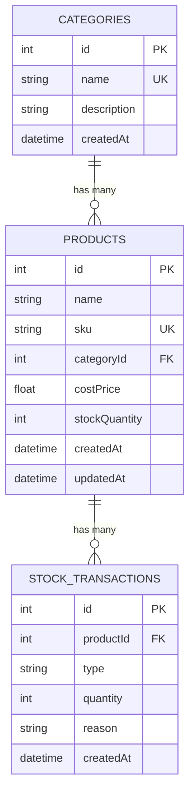

# 📦 Inventory Management System

ระบบจัดการสินค้าคงคลัง — REST API + หน้าเว็บใช้งานจริง
**Node.js (Express) + Prisma ORM + SQLite + React (Vite)**

> ✅ ทดสอบอัตโนมัติ **30 เคส ผ่านทั้งหมด** — รันได้ในเครื่องตัวเอง ไม่ต้องติดตั้ง database server และไม่แตะข้อมูลจริง

---

## 📑 สารบัญเอกสาร

| เอกสาร | เนื้อหา |
|---|---|
| [ER_DIAGRAM.md](ER_DIAGRAM.md) | แผนภาพ ER, ความสัมพันธ์, เหตุผลการออกแบบ, SQL จริง |
| [API_DOCS.md](API_DOCS.md) | URL / Method / Header / Request Body / Response (success + error) ครบทุก endpoint |

---

## 🚀 เริ่มใช้งาน (Quick Start)

ต้องมี **Node.js 18 ขึ้นไป**

### 1) Backend (API)

```bash
cd server
npm install
npx prisma migrate dev --name init
npm run seed
npm run dev
```

API จะรันที่ **http://localhost:4000** — ทดสอบด้วย http://localhost:4000/api/health

> `npm run seed` เป็นตัวเลือกเสริม ใช้ใส่ข้อมูลตัวอย่าง (4 หมวดหมู่ + 12 สินค้า) เพื่อให้เห็นหน้าจอมีข้อมูลทันที

### 2) Frontend (หน้าเว็บ)

เปิด terminal อีกหน้าต่าง

```bash
cd client
npm install
npm run dev
```

เปิดเบราว์เซอร์ที่ **http://localhost:5173**
(dev server ตั้ง proxy `/api` ไปที่ `http://localhost:4000` ไว้แล้ว — ไม่ติดปัญหา CORS)

### 3) รันชุดทดสอบ

```bash
cd server
npm test
```

---

## ✅ ผลการทดสอบ

ใช้ `node --test` (test runner ในตัวของ Node) + `supertest` ยิงเข้า Express app จริง
โดยสร้างไฟล์ **SQLite แยกต่างหาก (`prisma/test.db`)** ที่ล้างใหม่ทุกครั้งก่อนรัน — **ไม่แตะฐานข้อมูลใช้งานจริง (`dev.db`)**

```
ℹ tests 30
ℹ suites 7
ℹ pass 30
ℹ fail 0
```

ครอบคลุม:

- สร้างสินค้าสำเร็จ / SKU ซ้ำ (409) / ข้อมูลไม่ครบ (400) / ค่าติดลบ / categoryId ไม่มีจริง
- ปรับสต็อกรับเข้า (+) และจ่ายออก (−) พร้อมตรวจ log ประเภท `IN` / `OUT`
- **ตัดสต็อกเกินจำนวน → 400 และยืนยันว่าสต็อกไม่เปลี่ยน + ไม่มี transaction ถูกบันทึก**
- ตัดพอดีเหลือ 0 ต้องผ่าน, ปรับหลายครั้งติดกันยอดสะสมต้องถูกต้อง
- low-stock: ค่าเริ่มต้น < 5, กำหนด threshold เอง, การเรียงลำดับ, threshold ติดลบ
- list / filter หมวดหมู่ / ค้นหา / รายละเอียด + ประวัติ / 404
- หมวดหมู่: สร้าง, ชื่อซ้ำ (409), ไม่ระบุชื่อ (400)
- routing: `/api/products/low-stock` ต้องไม่ถูกจับเป็น `/api/products/:id`

---

## 🗂️ โครงสร้างฐานข้อมูล



รายละเอียดเหตุผลการออกแบบทั้งหมดอยู่ใน **[ER_DIAGRAM.md](ER_DIAGRAM.md)**

**หัวใจของการออกแบบ:** `stockQuantity` ถูกเก็บไว้ที่ตาราง `Product` เพื่อให้ query เร็ว
แต่การอัปเดตยอด **ต้องเกิดคู่กับการบันทึก `StockTransaction` ภายใน database transaction เดียวกันเสมอ**
ทำให้ยอดคงเหลือกับประวัติไม่มีทางไม่ตรงกัน

---

## 🔌 API Endpoints

| # | Method | URL | หน้าที่ |
|---|---|---|---|
| 1 | `POST` | `/api/products` | สร้างสินค้าใหม่ (กัน SKU ซ้ำ → 409) |
| 2 | `PATCH` | `/api/stock/adjust` | ปรับสต็อก +/− กันติดลบ + log ทุกครั้ง |
| 3 | `GET` | `/api/products/low-stock` | สินค้าคงเหลือน้อยกว่าเกณฑ์ (ค่าเริ่มต้น < 5) |
| 4 | `GET` | `/api/products` | รายการสินค้า + ค้นหา + กรอง + แบ่งหน้า |
| 5 | `GET` | `/api/products/:id` | รายละเอียด + ประวัติการเคลื่อนไหว |
| 6 | `GET` | `/api/stock/transactions` | ประวัติทั้งระบบ (กรอง `productId`, `type`) |
| 7 | `GET` / `POST` | `/api/categories` | จัดการหมวดหมู่ |
| 8 | `GET` | `/api/health` | ตรวจสอบสถานะ API |

ตัวอย่าง Request/Response ครบทุกกรณี (success + error) อยู่ใน **[API_DOCS.md](API_DOCS.md)**

### ตัวอย่างเร็ว

```bash
# สร้างสินค้า
curl -X POST http://localhost:4000/api/products -H "Content-Type: application/json" -d "{\"name\":\"Notebook Acer A14\",\"sku\":\"ACER-A14-001\",\"costPrice\":15900,\"stockQuantity\":10}"

# ตัดสต็อก 5 ชิ้น
curl -X PATCH http://localhost:4000/api/stock/adjust -H "Content-Type: application/json" -d "{\"productId\":1,\"quantity\":-5,\"reason\":\"ขายหน้าร้าน\"}"

# สินค้าใกล้หมด
curl "http://localhost:4000/api/products/low-stock?threshold=5"
```

---

## 🎨 หน้าจอการใช้งาน (UI/UX)

ออกแบบให้ "คนคุมสต็อกจริง" ใช้ได้โดยไม่ต้องอบรม

| หน้า | เส้นทาง | จุดเด่น |
|---|---|---|
| ภาพรวม | `/dashboard` | เห็นสถานะคลังทั้งหมดใน 3 วินาที: จำนวน SKU, ชิ้นรวม, ใกล้หมด, หมดสต็อก, มูลค่าคงคลัง + ความเคลื่อนไหวล่าสุด |
| รายการสินค้า | `/products` | ค้นหาแบบ debounce, กรองหมวดหมู่, แบ่งหน้า, แถบระดับสต็อก, ปุ่มปรับสต็อกในแถว |
| เพิ่มสินค้า | `/products/new` | validate ทันทีรายช่อง + พรีวิวข้อมูลและมูลค่าก่อนบันทึก |
| สินค้าใกล้หมด | `/low-stock` | ปรับเกณฑ์ได้ (3/5/10/20 หรือกรอกเอง) + badge บนเมนูบอกจำนวนที่ต้องเติม |
| รายละเอียดสินค้า | `/products/:id` | ยอดรับเข้า/จ่ายออกสะสม + ไทม์ไลน์ประวัติทั้งหมด |
| ประวัติสต็อก | `/transactions` | ดูทุกความเคลื่อนไหว กรอง IN / OUT |
| หมวดหมู่ | `/categories` | เพิ่มหมวดหมู่และดูจำนวนสินค้าต่อหมวด |

**หลักการ UX ที่ใช้**

- **ไม่ให้ผู้ใช้คิดเรื่องเครื่องหมายลบ** — ฟอร์มปรับสต็อกให้เลือก "รับเข้า / จ่ายออก" แล้วกรอกจำนวนบวกเสมอ ระบบใส่เครื่องหมายให้
- **เห็นผลก่อนกดยืนยัน** — พรีวิว `คงเหลือปัจจุบัน → หลังปรับ` และเตือนสีแดงทันทีถ้าจะติดลบ (กันตั้งแต่ฝั่ง UI ก่อนถึง API)
- **ปุ่มเหตุผลสำเร็จรูป** — เช่น "รับสินค้าจาก PO", "สินค้าชำรุด" ลดการพิมพ์ซ้ำและทำให้ประวัติสม่ำเสมอ
- **สื่อสารด้วยสี 3 ระดับ** — ปกติ (เขียว) / ใกล้หมด (เหลือง) / หมดสต็อก (แดง) พร้อมไอคอนกำกับ ไม่พึ่งสีอย่างเดียว
- **feedback ทุก action** — toast แจ้งผลสำเร็จ/ผิดพลาด พร้อมข้อความจาก API ตรงๆ
- **สถานะครบทุกแบบ** — loading (skeleton), empty state ที่บอกว่าให้ทำอะไรต่อ, error state ที่กดลองใหม่ได้
- **บอกเมื่อ API ล่ม** — แถบสถานะบน sidebar + คำแนะนำวิธีเปิด backend
- **ใช้ได้ทุกจอ + ธีมมืด/สว่าง** — responsive ตั้งแต่มือถือถึงเดสก์ท็อป, semantic HTML + `aria-*` และ `data-role` สำหรับต่อยอด

---

## 🗃️ โครงสร้างโปรเจกต์

```
inventory-system/
├── server/                    # Backend API
│   ├── index.js               # Express app + ทุก endpoint (export app ให้ test ใช้)
│   ├── server.js              # entry point (listen)
│   ├── prisma/
│   │   ├── schema.prisma      # นิยาม 3 ตาราง
│   │   ├── seed.js            # ข้อมูลตัวอย่าง
│   │   └── migrations/        # SQL migration ที่ commit ไว้จริง
│   └── tests/api.test.js      # ชุดทดสอบ 30 เคส
│
├── client/                    # Frontend (React + Vite)
│   └── src/
│       ├── api/inventoryApi.js    # axios instance + ฟังก์ชันเรียก API ทั้งหมด
│       ├── components/            # Toast, ProductTable, StockAdjustModal, ui
│       ├── pages/                 # Dashboard, ProductList, ProductForm, ProductDetail,
│       │                          # LowStock, Transactions, Categories
│       ├── styles.css             # design system (สี/ระยะ/เงา เป็น CSS variables)
│       └── App.jsx                # layout + routing
│
├── ER_DIAGRAM.md
├── API_DOCS.md
└── README.md
```

---

## ⚙️ การตั้งค่า

`server/.env` (ดูตัวอย่างที่ `server/.env.example`)

```env
DATABASE_URL="file:./dev.db"
PORT=4000
```

ถ้าต้องการให้ frontend ยิงไป backend คนละเครื่อง สร้าง `client/.env`

```env
VITE_API_BASE_URL=http://localhost:4000/api
```

---

## 🧠 หมายเหตุทางเทคนิค

- **กันสต็อกติดลบแบบกัน race condition** — การอ่านยอดปัจจุบันและการเขียนอยู่ใน `prisma.$transaction` เดียวกัน สองคำสั่งที่ตัดสต็อกพร้อมกันจึงไม่ทำให้ยอดติดลบ
- **ลำดับ route สำคัญ** — `/api/products/low-stock` ถูกประกาศก่อน `/api/products/:id` ไม่งั้น Express จะจับ `low-stock` เป็น `id` (มีเทสคุมกรณีนี้ไว้)
- **`quantity` ในตาราง transaction เก็บเป็นค่าบวกเสมอ** ทิศทางดูจาก `type` (`IN`/`OUT`) ทำให้รวมยอดรับ/ยอดจ่ายได้ตรงๆ
- **error กลางระบบ** — ทุก endpoint คืน `{ error: "..." }` รูปแบบเดียวกัน ทำให้ frontend แสดงผลได้ด้วย logic ชุดเดียว
